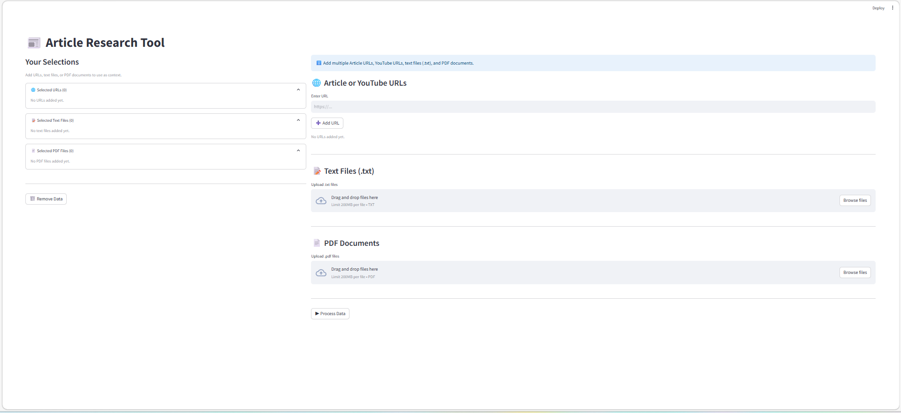
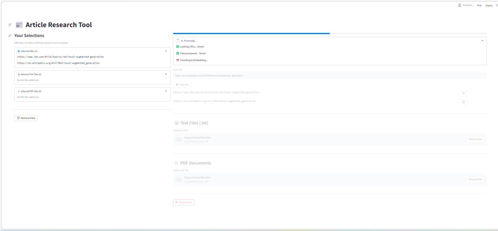
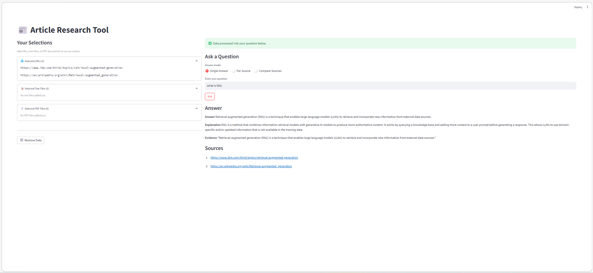
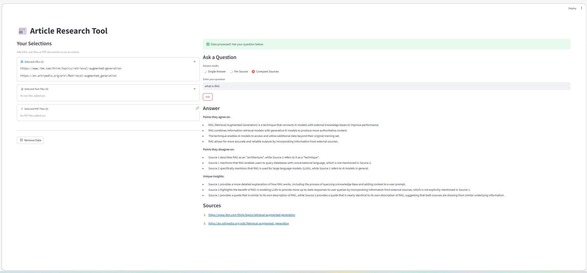

# 📰 Article Research Tool

> A production-grade Retrieval-Augmented Generation (RAG) web application that ingests content from multiple sources — article URLs, YouTube videos, PDFs, and TXT files — and enables intelligent question answering, per-source analysis, and multi-document comparison using Groq's Llama-3.3-70B and ChromaDB.

🔴 **[Live Demo](https://huggingface.co/spaces/sachuretnasm/article-research-tool)**


---

## 📸 Screenshots

### Upload Data


### Processing


### Single Answer


### Compare Sources


---

## ✨ Features

### Data Sources
- 🌐 **Article URLs** — Scrape any web article with automatic JS rendering fallback via Playwright
- 🎥 **YouTube Videos** — Extract and research video transcripts automatically
- 📄 **PDF Documents** — Upload and query PDF files
- 📝 **Text Files** — Upload and query TXT files
- 🔀 **Mixed Sources** — Combine any sources together in one research session

### RAG Pipeline
- 🧠 **Content-Aware Chunking** — Semantic chunking for articles, language-aware for code blocks, preserved for tables
- 🎯 **BGE Large Embeddings** — High quality semantic search using `BAAI/bge-large-en-v1.5`
- 🔍 **MMR Retrieval** — Maximal Marginal Relevance for diverse, relevant chunks
- 📊 **Structured Answers** — Every answer includes Answer, Explanation, and Evidence sections

### Answer Modes
- 💬 **Single Answer** — Combined answer from all sources
- 📑 **Per Source** — Separate answer from each source independently
- ⚖️ **Compare Sources** — AI comparison of agreements, disagreements, and unique insights

### Production Features
- 👥 **Multi-User Isolation** — Each user gets their own vectorstore session
- 📈 **Progress Tracking** — Real-time step-by-step progress bar
- 🐳 **Docker Deployment** — Fully containerized for consistent deployment
- ⚡ **Cached Embeddings** — Model loaded once shared across all users

---

## 🧱 Architecture

```
User Input (URL / YouTube / PDF / TXT)
              │
              ▼
    ┌─────────────────────┐
    │     loaders.py      │
    │  WebBaseLoader      │
    │  Playwright (JS)    │
    │  YouTube Transcript │
    │  PDF/TXT Reader     │
    └─────────┬───────────┘
              │
              ▼
    ┌─────────────────────┐
    │     chunking.py     │
    │  extract_content_   │
    │  types()            │
    │  ├── Code Blocks    │
    │  ├── Tables         │
    │  └── Text           │
    │                     │
    │  chunk_documents()  │
    │  ├── SemanticChunker│
    │  ├── Code Splitter  │
    │  └── Fast Splitter  │
    └─────────┬───────────┘
              │
              ▼
    ┌─────────────────────┐
    │   vectorstore.py    │
    │  BGE Large Embed    │
    │  ChromaDB Storage   │
    │  Session Isolation  │
    └─────────┬───────────┘
              │
              ▼
    ┌─────────────────────┐
    │    answering.py     │
    │  MMR Retrieval      │
    │  Single Answer      │
    │  Per Source         │
    │  Compare Sources    │
    └─────────┬───────────┘
              │
              ▼
    Structured Answer (Answer + Explanation + Evidence)
```

---

## 🛠️ Tech Stack

| Layer | Technology |
|---|---|
| **LLM** | Groq — Llama-3.3-70B |
| **Embeddings** | BAAI/bge-large-en-v1.5 |
| **Vector Database** | ChromaDB |
| **RAG Framework** | LangChain |
| **Web Scraping** | Playwright, WebBaseLoader |
| **YouTube** | youtube-transcript-api, pytube |
| **PDF Processing** | pypdf |
| **UI** | Streamlit |
| **Deployment** | Docker, Hugging Face Spaces |
| **Language** | Python 3.10+ |

---

## 📂 Project Structure

```
article-research-tool/
│
├── app.py                    # Streamlit UI & session management
├── rag/
│   ├── __init__.py           # Package exports
│   ├── config.py             # Constants & prompts
│   ├── loaders.py            # Data loading (URL, YouTube, PDF, TXT)
│   ├── chunking.py           # Content-aware chunking
│   ├── vectorstore.py        # Embeddings & ChromaDB
│   ├── pipeline.py           # process_data orchestration
│   └── answering.py          # Answer generation & comparison
├── resources/
│   └── vectorstore/          # ChromaDB storage (gitignored)
├── .streamlit/
│   └── config.toml           # Streamlit configuration
├── .github/
│   └── workflows/
│       └── ping.yml          # HF Space keep-alive
├── requirements.txt
├── Dockerfile
└── README.md
```

---

## 🚀 Getting Started

### 1. Clone the Repository

```bash
git clone https://github.com/Sachursm/article-research-tool.git
cd article-research-tool
```

### 2. Create & Activate Virtual Environment

```bash
python -m venv venv

# macOS / Linux
source venv/bin/activate

# Windows
venv\Scripts\activate
```

### 3. Install Dependencies

```bash
pip install -r requirements.txt
playwright install chromium
```

### 4. Set Your Groq API Key

Create a `.env` file in the project root:

```env
GROQ_API_KEY=your_groq_api_key_here
```

> Get your free API key at [console.groq.com](https://console.groq.com)

### 5. Run the App

```bash
streamlit run app.py
```

Open your browser at: **http://localhost:8501**

---

### 🐳 Run with Docker

```bash
docker build -t article-research-tool .
docker run -p 8501:8501 -e GROQ_API_KEY=your_key article-research-tool
```

---

## 📖 How to Use

### Step 1 — Add Sources
- Paste article or YouTube URLs one by one
- Upload PDF or TXT files
- Mix any combination of sources

### Step 2 — Process Data
- Click **▶ Process Data**
- Watch real-time progress (Loading → Chunking → Embedding → Saving)

### Step 3 — Ask Questions
Choose your answer mode:
- **Single Answer** — Best for one source or combined research
- **Per Source** — See what each source says independently
- **Compare Sources** — Find agreements, disagreements, unique insights

---

## 💡 Example Use Cases

```
Research comparison:
→ Add 2-3 news articles on same topic
→ Use Compare Sources mode
→ See what each publication says differently

Resume analysis:
→ Upload your PDF resume
→ Ask "what is my experience?"
→ Get structured answer with evidence

YouTube research:
→ Add a tutorial video URL
→ Ask specific questions about the content
→ Get answer with evidence quotes

Mixed research:
→ Article URL + PDF + YouTube video
→ Ask one question across all sources
→ Get comprehensive answer
```

---

## 🔑 Key Implementation Details

- **Content-Aware Chunking** — Detects and separately handles code blocks, tables, and text
- **Semantic Chunking** — Splits web articles by meaning, not character count
- **Session Isolation** — Each user gets unique ChromaDB collection via UUID
- **Playwright Fallback** — Automatically handles JavaScript-rendered websites
- **Transcript Cleaning** — Removes filler words from YouTube transcripts
- **Structured Prompts** — Engineered to always return Answer + Explanation + Evidence

---

## 👤 Author

**Sachu Retna SM** — AI/ML Engineer

[](https://github.com/Sachursm)
[](mailto:sachuretnasm@gmail.com)

---

<p align="center">Built with ❤️ using LangChain, Groq, ChromaDB, Playwright & Streamlit</p>